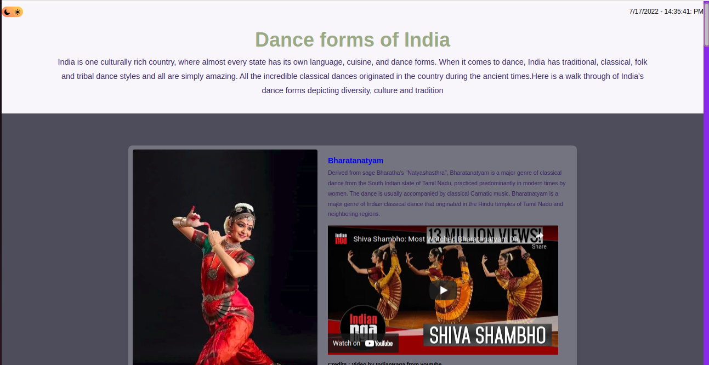
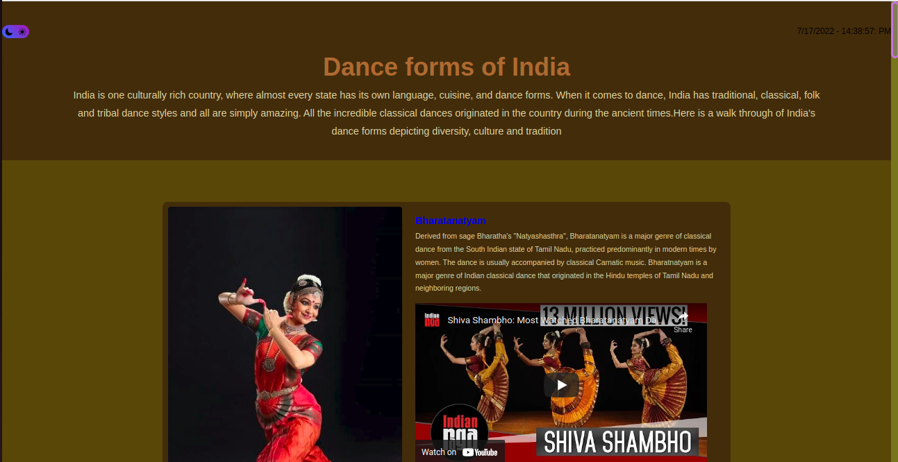

# Dance forms of India

Website talks about different dance forms of India using HTML, CSS , Javascript. I wanted to use the contents that I learnt from Essential trainings for HTML, CSS , Javascript on LinkedIn. I designed this website to accomodate the various components that I picked up throughout the course.

Javascript is used to change color-themes and show current datetime.

Styling for the website inculdes flexbox grid, border, inline.

## Sample Screenshots

### Light Theme

### Dark Theme

